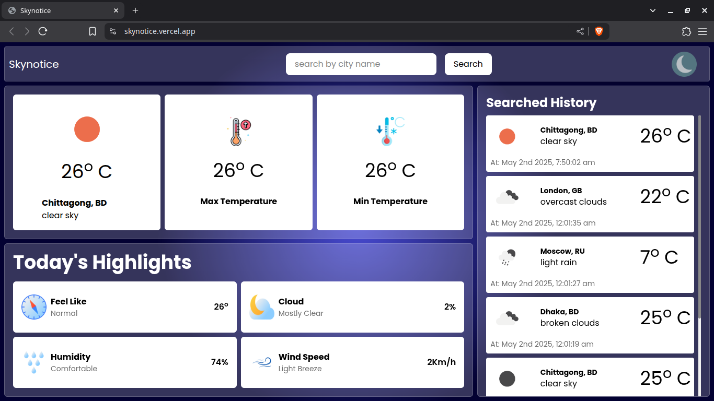
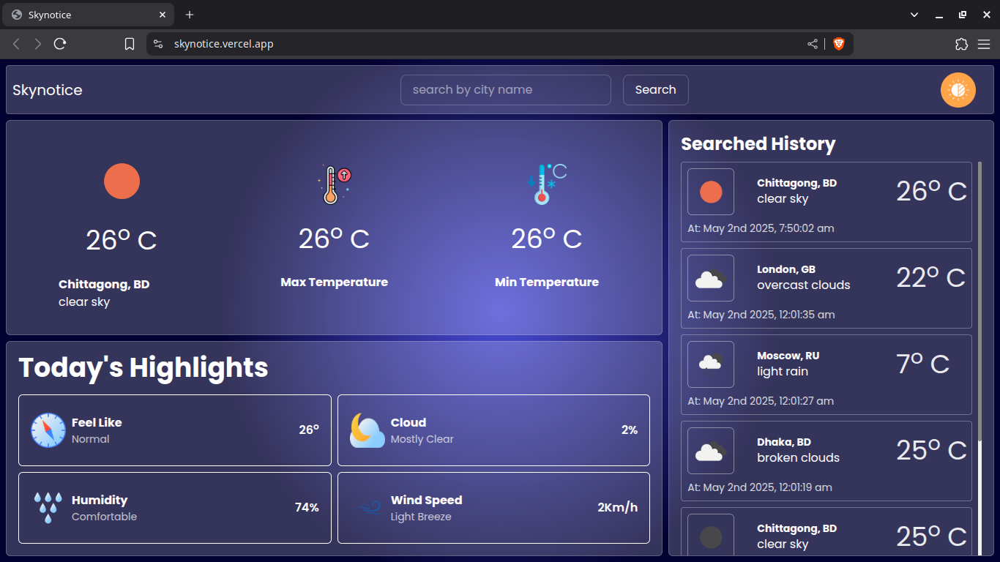

# Skynotice

Skynotice is an elegant and responsive weather web application that allows users to search for real-time weather updates of any city. It shows the current temperature, min/max values, sky conditions, and other weather highlights in an easy-to-use modern interface.

### Features.

- **City-based Weather Search**.
  Lookup any city and get the current weather data along with the current, max, and min temperature.

- **Detailed Highlights Panel**.
  Get more insights with.

  - Max temperature and min temperature times.
  - Feel-like temperature.
  - Humidity levels.
  - Cloud percentage.
  - Wind speed.

- **Search History**.
  Records your latest city searches along with time.

- **Dark Mode Support**.
  Eye-comfortable dark mode toggle included.

### preview Image

###### Light mode



###### Dark mode



### Technologies Used.

- **Frontend:**.

  - React.js.
  - Do you know HTML5 and CSS3?
  - JavaScript.
  - Axios for API requests.
  - Moment.js for date formatting.

- **API:**.

  - We will use the OpenWeatherMap API.

- **Other:**.
  - Responsive Design.
  - Storage in your device for history.
  - Icons & illustrations.

### Installation.

1. **Clone the repository:**.

```bash.
git clone https://github.com/hm-faisal/skynotice.git.
cd skynotice.
```

2. **Install dependencies:**.

```bash.
npm install
```

3. **Set up environment Variables:**

```bash
# Base url
VITE_WEATHER_BASE_URL=https://api.openweathermap.org/data/2.5/weather?appid=[your_api_key]

# default Location
VITE_WEATHER_DEFAULT_LOCATION=[your_default_location]
```

4. **Start the development server:**

```bash.
npm run dev
```

5. **Visit the app:**
   Open your browser and go to http://localhost:5173

### Project Structure

```
skynotice/
├── src/
│   ├── app/
│   ├── assets/
│   ├── components/
│   ├── features/
│   ├── hooks/
│   ├── styles/
│   ├── types/
│   ├── utils/
│   └── main.tsx
├── .env.local
├── package.json
└── README.md
```

### Future Improvements

- Unit switching (°C/°F)

### Project Dependencies

| Package           | Version | Notes                    |
| ----------------- | ------- | ------------------------ |
| @reduxjs/toolkit  | ^2.7.0  | Compatible with React 19 |
| @tailwindcss/vite | ^4.1.5  | Tailwind Vite plugin     |
| axios             | ^1.9.0  | HTTP client              |
| moment            | ^2.30.1 | Date handling            |
| react             | ^19.0.0 | latest React             |
| react-dom         | ^19.0.0 | latest React             |
| react-redux       | ^9.2.0  | Use with React 19        |
| tailwindcss       | ^4.1.5  | Latest version           |
